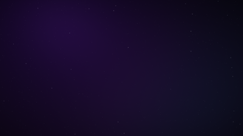

# NX for KDE Plasma 6

Liquid glass on deep space, for your whole desktop. This is the
[NX design language](docs/DESIGN.md) — dark violet space, frosted glass,
light behaving physically — implemented as a complete KDE Plasma 6 theme
suite.



## What's in the box

| Component | Name in System Settings |
| --- | --- |
| Global Theme (one-click everything) | **NX** |
| Color scheme | NX |
| Plasma style (panels, popups, tooltips) | NX |
| Window decorations (Aurorae) | NX |
| Icon theme (inherits Breeze Dark) | NX |
| Cursor theme (xcursor + Plasma 6 SVG cursors) | NX Cursors |
| Wallpaper (generated nebula + starfield) | NX Nebula |
| Splash screen | NX |
| Konsole color scheme | NX |
| SDDM login theme (optional, root) | nx |

## Install

```bash
./install.sh            # install everything user-local
./install.sh --apply    # …and switch the current session to NX
./install.sh --sddm     # …also install the login screen (sudo)
```

Then pick **NX** under *System Settings → Colors & Themes → Global Theme*
(skip if you used `--apply`). Konsole: *Settings → Edit Current Profile →
Appearance → NX*.

Remove everything with `./uninstall.sh`.

## Requirements

- KDE Plasma **6.2+** (built against 6.7). Breeze and Breeze Dark installed
  (they always are) — NX inherits from them for anything it doesn't restyle.
- For the KWin blur behind panels and glass surfaces: the Blur desktop effect
  enabled (default on).

Nothing needs to be built — all generated assets (wallpaper renders, cursor
binaries) are committed. The generators live in `tools/` (Python 3 + PIL +
numpy + `rsvg-convert`) if you want to regenerate or tweak.

## Design rules this follows

- One light source, upper-left, in every gradient, bevel, and edge.
- Violet `#7700FF` leads; cyan `#00E5FF` is light inside materials, never a
  surface; amber only ever means "attention".
- Translucency is low-alpha; no solid gray dividers — hairlines fade at both
  ends.
- The full token spec and rationale: [docs/DESIGN.md](docs/DESIGN.md), and the
  KDE-specific color contract: [docs/BRIEF.md](docs/BRIEF.md).

## License

GPL-3.0-or-later (see [LICENSE](LICENSE)). Parts of the Plasma style, icon
theme, and SDDM theme are derived from KDE's Breeze
(LGPL-3.0 / GPL-2.0-or-later, © KDE contributors); those files retain their
original licenses.
